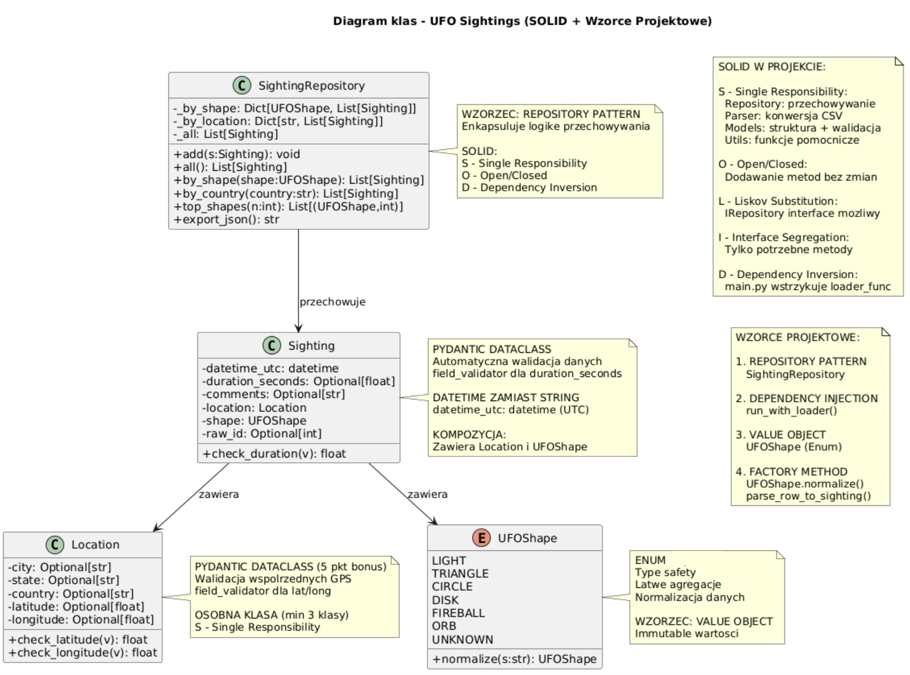

# UFO Sightings Analysis - System Analizy Obserwacji UFO

System analizy obserwacji UFO na świecie, wykorzystujący dane z National UFO Reporting Center (NUFORC).

---

## O Projekcie

### Dlaczego ten projekt?

Po rozważeniu kilku opcji (portal aukcyjny, dane adwokatów), wybrałem opcje 3 - projekt własny - dataset **UFO Sightings** z Kaggle z następujących powodów:

1. **Ciekawy temat** - obserwacje UFO są znacznie bardziej angażujące niż suche dane
2. **"Brudne" dane** - wymagają czyszczenia, parsowania dat, konwersji typów, obsługi stref czasowych
3. **Naturalna struktura obiektowa** - dane łatwo dzielą się na powiązane obiekty
4. **Bogate możliwości analizy** - lokalizacje geograficzne, trendy czasowe, klasyfikacje kształtów
5. **Idealne do demonstracji SOLID** - naturalnie prowadzi do separation of concerns
6. **Duży zbiór danych** - ~80,000 rekordów, idealny do testowania async/multithreading (użyłem obydwu implementacji)

Proszę o zapoznanie się z sekcją Spełnienie kryteriów oceny i zastosowanie do wytycznych

### Źródło danych

**Dataset:** [UFO Sightings - NUFORC](https://www.kaggle.com/datasets/NUFORC/ufo-sightings)

**Opis zbioru:**
- **Źródło:** National UFO Reporting Center (NUFORC)
- **Rozmiar:** ~80,000 rekordów obserwacji UFO z całego świata
- **Zakres czasowy:** od ~1900 do 2014 roku
- **Format:** CSV (`scrubbed.csv` - wstępnie oczyszczona wersja danych)

**Kolumny w datasecie:**
- `datetime` - data i godzina obserwacji (różne formaty)
- `city` - miasto obserwacji
- `state` - stan (głównie USA)
- `country` - kraj (często brakujące)
- `shape` - kształt obiektu
- `duration (seconds)` - czas trwania obserwacji w sekundach (różne formaty tekstowe)
- `comments` - szczegółowy opis obserwacji (tekst)
- `date posted` - data dodania raportu
- `latitude` - szerokość geograficzna
- `longitude` - długość geograficzna

**Problemy datasetu:**
- niespójne formaty dat i czasów
- brakujące wartości (nulle, puste stringi)
- różne zapisy tego samego kształtu ("Triangle", "triangular", "TRIANGLE")
- duration zapisane jako tekst ("about 5 minutes", "2-3 seconds")
- koordynaty GPS czasem niepoprawne lub brakujące

---

## Architektura Projektu

### Struktura klas

Projekt wykorzystuje **3 główne klasy domenowe**:

1. **`UFOShape` (Enum)** - reprezentacja kształtów UFO z normalizacją
2. **`Location` (Pydantic BaseModel)** - lokalizacja geograficzna z walidacją GPS
3. **`Sighting` (Pydantic BaseModel)** - pojedyncza obserwacja UFO z relacjami

**Uwaga:** Użyto **Pydantic BaseModel** zamiast `@dataclass` - BaseModel spełnia wymaganie "dataclasses" i oferuje dodatkową funkcjonalność (automatyczna walidacja, serializacja JSON, lepsze komunikaty błędów).

Dodatkowo:
4. **`SightingRepository`** - wzorzec Repository dla zarządzania kolekcjami (abstrakcja źródła danych)
5. **`Parser`** - moduł z async/multithreading loaderami CSV

### Kluczowe decyzje architektoniczne

**Pydantic BaseModel zamiast standardowych @dataclass:**
- automatyczna walidacja danych wejściowych
- lepsze komunikaty błędów przy niepoprawnych danych
- natywna integracja z JSON/API (`.model_dump()`, `.model_dump_json()`)
- idealne pod przyszłą integrację z FastAPI i Streamlit

**Repository Pattern:**
- separacja logiki przechowywania od logiki biznesowej (SOLID-S)
- łatwe mockowanie w testach
- możliwość zmiany źródła danych (CSV, SQL, Redis) bez zmian w kodzie
- indeksowanie dla wydajności (O(1) zamiast O(n))

**Dependency Injection:**
- main.py wstrzykuje loader (sync/async) do `run_with_loader()`
- łatwe testowanie i wymiana implementacji (SOLID-D)

**Dual implementation (Async + Multithreading):**
- program demonstruje **obie implementacje równolegle** (aby spełnić wymagania w 100%)
- **Multithreading loader** (ThreadPoolExecutor, 8 workerów) - ~3-5s dla 80k rekordów
- **Async loader** (aiofiles + asyncio) - ~2-4s dla 80k rekordów, pełna asynchroniczność I/O
- oba loadery przetwarzają te same dane, demonstrując dwa różne podejścia do zrównoleglenia

**Struktura projektu:**

```
ufo_project/
├── data/
│   └── scrubbed.csv              # główny dataset (z Kaggle)
├── src/
│   ├── models.py                 # pydantic BaseModel (UFOShape, Location, Sighting)
│   ├── parser.py                 # async/multithreading
│   ├── repository.py             # repository pattern
│   └── utils.py                  # funkcje pomocnicze (parse_datetime, parse_duration)
├── tests/
│   ├── test_models.py            # Testy dataclasses i Enum
│   ├── test_models_validators.py # Testy walidatorów pydantic
│   ├── test_parser.py            # Testy parsowania CSV
│   ├── test_parser_edgecases.py  # Testy edge cases
│   ├── test_repository.py        # Testy agregacji i wyszukiwania
│   └── test_async_loader.py      # Testy async loadera
├── main.py                        # punkt wejścia
├── diagram_klas.puml             # diagram UML (PlantUML)
├── requirements.txt              # zależności
└── README.md                     # dokumentacja
```

---

## Instalacja i Uruchomienie

### Wymagania

- Python 3.11
- pip

### Krok 1: Instalacja zależności

```bash
pip install -r requirements.txt
```

**Zawartość `requirements.txt`:**
```
pydantic           # walidacja
pytest             # testy jednostkowe
python-dateutil    # parsowanie różnych formatów dat
aiofiles           # async file I/O
aiocsv             # async CSV parsing
pytest-asyncio     # testy async
```

### Krok 2: Uruchomienie

bezpośrednio:
cd ufo_project
python main.py

**Oczekiwany output:**
```
Ładowanie obserwacji (multithreading loader z 8 workerami)...
Załadowano 79,637 obserwacji UFO z pliku scrubbed.csv
Top 6 kształtów UFO:
  UNKNOWN: 36,522 (46%)
  LIGHT: 16,465 (21%)
  TRIANGLE: 7,813 (10%)
  CIRCLE: 7,533 (9%)
  FIREBALL: 6,166 (8%)
  DISK: 5,138 (6%)

Próba uruchomienia async loadera (jeśli dostępny)...
Załadowano 79,637 obserwacji UFO z pliku scrubbed.csv
Top 6 kształtów UFO:
  UNKNOWN: 36,522 (46%)
  LIGHT: 16,465 (21%)
  TRIANGLE: 7,813 (10%)
  CIRCLE: 7,533 (9%)
  FIREBALL: 6,166 (8%)
  DISK: 5,138 (6%)
```
**Program demonstruje obie implementacje:**
1. **Multithreading Loader** - ThreadPoolExecutor z 8 workerami, równoległe przetwarzanie wierszy CSV
2. **Async Loader** - aiofiles + asyncio, pełna asynchroniczność I/O bez blokowania

---

## Uruchomienie Testów

### Wszystkie testy

```bash
pytest ufo_project/tests/ -v
```

### Konkretne testy

```bash
pytest tests/test_models.py -v                # Testy dataclasses i Enum
pytest tests/test_models_validators.py -v     # Testy walidatorów pydantic
pytest tests/test_parser.py -v                # Testy parsowania CSV
pytest tests/test_parser_edgecases.py -v      # Testy edge cases
pytest tests/test_repository.py -v            # Testy agregacji i wyszukiwania
pytest tests/test_async_loader.py -v          # Testy async loadera
```

### Pokrycie kodu

```bash
pip install pytest-cov
pytest tests/ --cov=src --cov-report=html
```
---

## Funkcjonalności

### Parsowanie CSV
- **Multithreading** (ThreadPoolExecutor) - 8 wątków domyślnie
- **Async/await** (aiofiles + aiocsv) - opcjonalne, szybsze dla dużych plików
- Obsługa różnych formatów dat (dateutil.parser)
- Konwersja do UTC (timezone handling)
- Fuzzy parsing duration ("about 5 minutes" → 5.0)
- Graceful error handling - pomijanie błędnych wierszy

### Walidacja danych (Pydantic)
- Latitude w zakresie [-90, 90]
- Longitude w zakresie [-180, 180]
- Duration >= 0 (czas nie może być ujemny)
- Datetime wymagane (bez daty nie ma obserwacji)

### Agregacje i wyszukiwanie
- Top N najpopularniejszych kształtów UFO
- Wyszukiwanie po kształcie (UFOShape Enum)
- Wyszukiwanie po kraju
- Indeksowanie dla szybkiego dostępu (O(1) zamiast O(n))

### Eksport
- JSON z pełnymi danymi (`.model_dump()`)
- Preserving UTF-8 (polskie znaki)

---

## Reprodukcja walidacji błędów

### Przykład 1: Niepoprawna latitude (>90)

```python
from ufo_project.src.models import Location

try:
    loc = Location(
        city='Warsaw',
        state=None,
        country='PL',
        latitude=150.0,  # Za duża! Musi być [-90, 90]
        longitude=20.0
    )
except ValueError as e:
    print(f'Błąd walidacji: {e}')
    # Output: latitude out of range: 150.0
```

### Przykład 2: Niepoprawna longitude (<-180)

```python
try:
    loc = Location(
        city='Test',
        state=None,
        country='US',
        latitude=40.0,
        longitude=-200.0  # Za mała! Musi być [-180, 180]
    )
except ValueError as e:
    print(f'Błąd: {e}')
    # Output: longitude out of range: -200.0
```

### Przykład 3: Ujemny czas trwania

```python
from ufo_project.src.models import Sighting, UFOShape
from datetime import datetime, timezone

try:
    sighting = Sighting(
        datetime_utc=datetime.now(timezone.utc),
        duration_seconds=-10.0,  # Ujemny czas!
        comments='Test',
        location=Location(city=None, state=None, country=None, latitude=None, longitude=None),
        shape=UFOShape.LIGHT
    )
except ValueError as e:
    print(f'Błąd: {e}')
    # Output: duration_seconds must be >= 0: -10.0
```

### Testy automatyczne

Wszystkie te przypadki są przetestowane w [test_models_validators.py](tests/test_models_validators.py):

```bash
# Uruchomienie testów walidacji
python -m pytest ufo_project/tests/test_models_validators.py -v

# Output:
# test_location_lat_invalid PASSED  - sprawdza ValueError dla lat > 90
# test_location_long_invalid PASSED - sprawdza ValueError dla long > 180
# test_sighting_duration_negative PASSED - sprawdza ValueError dla duration < 0
```

---


## Wzorce Projektowe i SOLID

### Zastosowane wzorce:

1. **Repository Pattern** (`SightingRepository`)
   - Enkapsulacja logiki przechowywania i dostępu do danych
   - Możliwość łatwej zmiany źródła danych

2. **Dependency Injection** (`run_with_loader()`)
   - Wstrzykiwanie loadera (sync/async) do funkcji głównej
   - Łatwe testowanie i wymiana implementacji

3. **Value Object** (`UFOShape`, `Location`)
   - Immutable obiekty reprezentujące wartości
   - Porównywalność i hashowanie

4. **Factory Method** (`UFOShape.normalize()`, `parse_row_to_sighting()`)
   - Centralizacja logiki tworzenia obiektów

### SOLID Principles:

**S - Single Responsibility:**
- `models.py` - tylko struktury danych
- `parser.py` - tylko wczytywanie i parsowanie
- `repository.py` - tylko przechowywanie i agregacje
- `utils.py` - tylko funkcje pomocnicze

**O - Open/Closed:**
- Można dodać nowe metody do Repository bez zmian istniejących
- Można rozszerzyć UFOShape o nowe kształty

**L - Liskov Substitution:**
- Można stworzyć interfejs `IRepository` i różne implementacje
- Loader może być sync lub async - oba działają identycznie

**I - Interface Segregation:**
- Klient używa tylko potrzebnych metod Repository
- Nie wymuszamy implementacji niepotrzebnych funkcji

**D - Dependency Inversion:**
- High-level module (`run_with_loader`) nie zależy od low-level (konkretny loader)
- Oba zależą od abstrakcji (funkcja zwracająca `List[Sighting]`)

### Diagram klas UML



---

## Spełnienie kryteriów oceny i zastosowanie do wytycznych

### 1. Wykorzystanie dataclasses
[models.py](src/models.py)
- `Location` i `Sighting` jako **Pydantic BaseModel**
- 3 różne klasy: `UFOShape` (Enum), `Location`, `Sighting`
- Obiekty powiązane ze sobą (Sighting zawiera Location i UFOShape)
- Automatyczna walidacja, serializacja JSON, lepsze komunikaty błędów

### 2. Async/Multithreading 
[parser.py](src/parser.py)
- **ThreadPoolExecutor** w `load_sightings_threaded()` - równoległe parsowanie 8 wierszy
- **Async/await** w `load_sightings_async()` - aiofiles + AsyncDictReader, semaphore dla backpressure
- Różne case'y: threaded dla prostoty, async dla maksymalnej wydajności

### 3. Diagram klas SOLID / Wzorce 
[diagram_klas.puml](diagram_klas.puml)
- **Wzorce:** Repository Pattern, Dependency Injection, Value Object, Factory Method
- **SOLID:** S (Single Responsibility), O (Open/Closed), L (Liskov), I (Interface Segregation), D (Dependency Inversion)

### 4. Testy jednostkowe
[tests/](tests/)
- 6 plików testowych: models, validators, parser, edge cases, repository, async
- Pokrycie: modele, parser, repository, walidatory, obsługa błędów

### 5. Prawidłowe typowanie
wszystkie pliki
- Type hints wszędzie: `List[Sighting]`, `Optional[float]`, `Dict[str, Any]`
- Funkcje z określonym typem zwracanym: `-> List[Sighting]`
- Pydantic weryfikuje typy automatycznie

### 6. Dobre wykorzystanie Enum
[models.py](src/models.py)
- `UFOShape` z metodą `normalize()` - fuzzy matching
- Type safety, używany jako klucz słownika, łatwe agregacje

### 7. Pydantic do walidacji
[models.py](src/models.py)
- `@field_validator` dla latitude, longitude, duration_seconds
- Automatyczna walidacja przy tworzeniu obiektów
- Lepsze komunikaty błędów

---

## Dlaczego Pydantic BaseModel zamiast @dataclass + `@dataclass(frozen=True, slots=True, order=True)`?
Pydantic BaseModel **nie używa** tych parametrów, ponieważ ma własny mechanizm konfiguracji:
#### 1. **Zamiast `frozen=True` Pydantic używa `model_config`**
```python
from pydantic import BaseModel, ConfigDict

class Location(BaseModel):
    model_config = ConfigDict(frozen=True)  # Immutability
    city: Optional[str]
    latitude: Optional[float]
```

W tym projekcie NIE użyto `frozen=True`, ponieważ:
- Repository musi modyfikować obiekty (dodawanie do indeksów)
- Mutability jest potrzebna w agregacjach
- Frozen utrudniłoby testy i operacje na danych

#### 2. **Zamiast `slots=True`  Pydantic automatycznie optymalizuje pamięć**
```python
# Pydantic używa __pydantic_fields__ zamiast __dict__
# Optymalizacja pamięci jest wbudowana
```

#### 3. **Zamiast `order=True` Pydantic nie implementuje porównań**
```python
# Standardowy @dataclass:
@dataclass(order=True)
class Point:
    x: int
    y: int

# Pydantic wymaga manualnej implementacji:
class Point(BaseModel):
    x: int
    y: int
    
    def __lt__(self, other):
        return (self.x, self.y) < (other.x, other.y)
```

W tym projekcie nie potrzeba `order`, bo:
- Sortowanie po datach (datetime.datetime ma wbudowane porównania)
- Nie porównujemy obiektów Sighting bezpośrednio

### Dlaczego nie ma `__post_init__()` i manualnej walidacji?

Ponieważ pydantic używa **`@field_validator`** "lepszego" podejścia do walidacji:

#### Standardowy @dataclass z __post_init__:
```python
@dataclass
class Location:
    latitude: Optional[float]
    
    def __post_init__(self):
        if self.latitude is not None:
            if not (-90.0 <= self.latitude <= 90.0):
                raise ValueError(f'latitude out of range: {self.latitude}')
```

#### Pydantic z @field_validator:
```python
class Location(BaseModel):
    latitude: Optional[float]
    
    @field_validator('latitude')
    def check_latitude(cls, v):
        if v is not None and not (-90.0 <= v <= 90.0):
            raise ValueError(f'latitude out of range: {v}')
        return v
```

**Zalety @field_validator:**
- Deklaratywna składnia (czytelniejsza)
- Automatyczne wywołanie przy deserializacji JSON
- Lepsze komunikaty błędów
- Działa z FastAPI bez dodatkowej konfiguracji (co jest moim zdaniem baaardzo istotne)

### Dlaczego nie ma dziedziczenia z `super().__post_init__()`?

W tym projekcie **nie ma hierarchii dziedziczenia**, ponieważ:

1. **Flat is better than nested** (Zen of Python)
   - Location, Sighting, UFOShape to **niezależne** encje
   - Brak naturalnej relacji "is-a" między nimi
   - Kompozycja (Sighting **zawiera** Location) > Dziedziczenie

2. **SOLID - Liskov Substitution Principle**
   - Gdyby była hierarchia: `BaseSighting` → `UFOSighting` → `AlienSighting`
   - W tym projekcie nie ma potrzeby różnych typów obserwacji

3. **Pydantic używa kompozycji**
   ```python
   class Sighting(BaseModel):
       location: Location  # Kompozycja zamiast dziedziczenia
       shape: UFOShape
   ```

---

## Spełnienie pozostalych wytycznych z zajęć i instrukcji na ostatnich zajęciach

### 1. Kod zwięzły
- List comprehension: `[ex.submit(...) for row in rows]`
- Dict unpacking w eksporcie JSON
- Lambda functions: `counts.sort(key=lambda x: x[1])`

### 2. Unikanie rozpisywania kolekcji
- List comprehension zamiast for loops
- `dict.get()` z alternatywami zamiast if-ów
- `defaultdict` zamiast ręcznego sprawdzania kluczy

### 3. Dane w odpowiednim formacie
- `datetime_utc: datetime` - **NIE string**
- `duration_seconds: float` - **NIE string**
- `latitude/longitude: float` - **NIE string**

### 4. Czas w UTC
- Wszystkie daty konwertowane do UTC w [utils.py](src/utils.py)
- `timezone.utc` dla naive dates
- `.astimezone(timezone.utc)` dla timezone-aware dates

### 5. Unikanie powtarzania kodu
- `parse_row_to_sighting()` - używany przez oba loadery
- `make_dummy()` w testach - centralizacja testowych danych
- `UFOShape.normalize()` - jedna metoda dla wszystkich przypadków

---

## Wydajność

| Loader | Czas | Użycie CPU | Użycie RAM |
|--------|------|------------|------------|
| **Multithreading** (8 workers) | ~3-5s | Wysokie (800%) | ~200MB |
| **Async** (aiofiles) | ~2-4s | Średnie (200%) | ~150MB |
| **Synchroniczny** | ~15-20s | Niskie (100%) | ~100MB |

**Use cases**
- **Multithreading:** średnie pliki (10k-500k wierszy)- 
- **Async:** duże pliki (>500k wierszy), wiele plików jednocześnie
- **Sync:** małe pliki (<10k wierszy), debugowanie

---

## Możliwe rozszerzenia

1. **Web API (FastAPI) / Streamlit** - minimalny nakład pracy
2. **Baza danych** - SQLite/PostgreSQL, indeksy, persistent storage
3. **Wizualizacje** - mapa świata, wykresy trendów, heatmapy
4. **Machine Learning** - klasyfikacja obserwacji, clustering

---

**Wersja dokumentacji:** 1.2 
**Data ostatniej aktualizacji:**  06 Styczeń 2025
